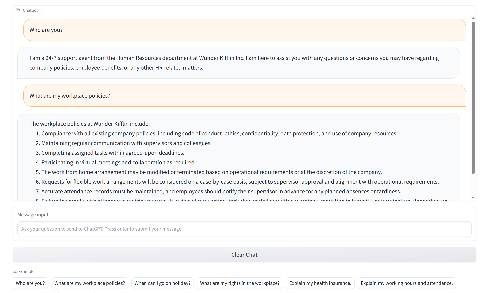

# Introduction
This project allows a conversational retrieval chain using the LangChain framework to allow LLM, such as OpenAI's ChatGPT, to excel at answering user made questions with new information by inputting custom text documents and other written data files that is typically not seen in pre-trained datasets. This is achieved by using vector embeddings to allow semantic search over such new documents that is chain-fed into LLMs to refine conversational outputs between the user and agent. 

We will be exploring this project in the context of a fictious e-commerce company named "Wunder Kifflin Inc." as an example made purely for fun. By law, all companies are required to implement workplace policies to protect the rights and safety of employees as well as to provide wide-depth amount of information about the operations of a company conveyed to its employees.

Workplace policies are then stored inside a directory which contains 11 unique text documents, where each document therefore represents a different work-place policy. Such documents can then serve as a library of reference text that can be semantically searched by OpenAI's ChatGPT (turbo model GPT-3.5) after it is vector embedded and chunked. ChatGPT will then serve as a 24/7 365 support chatbot agent in the HR department to allow Wunder Kifflin Inc. employees to ask specific questions as user enquiries related to paid holidays, work hours, workplace rights, promotion eligibility and etc. 

ChatGPT is then a perfect model for this project due to its rise of recent popularity and usage as an information library and as an effective communicator using native language profiency towards its users. Given that its database cut-off date is from September 2021 as of the time of this writing, the need for a LLM to be trained on a custom dataset is ever more prevalent.
Demonstration of a LLM in a practical commercial setting, such as OpenAI's ChatGPT, can then allow the use of automated AI to provide effective communication with the company's employees to assist them on matters where required to help delegate less important tasks within its business.




# Training data
- 11 unique work policy text documents that is pre-written and generated by ChatGPT.
- 1 descriptive text document that explains the user and agent in the context of Wunder Kifflin Inc. <br/>

See more details in the [workplace-policies section](#workplace-policies).


# Model and Structure
- [OpenAI's Turbo GPT-3.5 Model (ChatGPT-3)](https://openai.com/chatgpt)
- [LangChain framework](https://python.langchain.com/docs/get_started/introduction.html)

 <br/>
Source: https://blog.langchain.dev/retrieval/


# Installation
Requires [Microsoft Visual C++ Version 14.0+](https://visualstudio.microsoft.com/downloads/#build-tools-for-visual-studio), [Python3+](https://www.python.org/downloads/).

Download all require packages via pip:
```
pip install -r requirements.txt
```


# Set-up
1. Create your own .env file in root.
2. Make a OPENAI_KEY variable.
3. Set your variable to your [OpenAI API Secret Key](https://platform.openai.com/account/api-keys).

# Run server (chatbot)

```
cd your-installation-folder
./index.py
Running at http://127.0.0.1:8080
```


# Workplace-policies

1. [Code of Conduct and Ethics](/work-policies/Code_of_conduct_and_ethics.txt)
2. [Confidentiality and Data Protection](/work-policies/Confidentiality_and_data_protection.txt)
3. [Diversity and Inclusion](/work-policies/Diversity_and_inclusion.txt)
4. [Employee Benefits and Perks](/work-policies/Employee_benefits_and_perks.txt)
5. [Grievance Procedure](/work-policies/Grievance_procedure.txt)
6. [Health Insurance](/work-policies/Health_insurance.txt)
7. [Holidays and Sick Days](/work-policies/Holidays_and_sick_days.txt)
8. [Performance Evaluation and Career Development](/work-policies/Performance_evaluation_and_career_development.txt)
9. [Performance Management](/work-policies/Performance_management.txt)
10. [Working Hours and Attendance](/work-policies/Working_hours_and_attendance.txt)
11. [Workplace Safety and Security](/work-policies/Workplace_safety_and_security.txt)